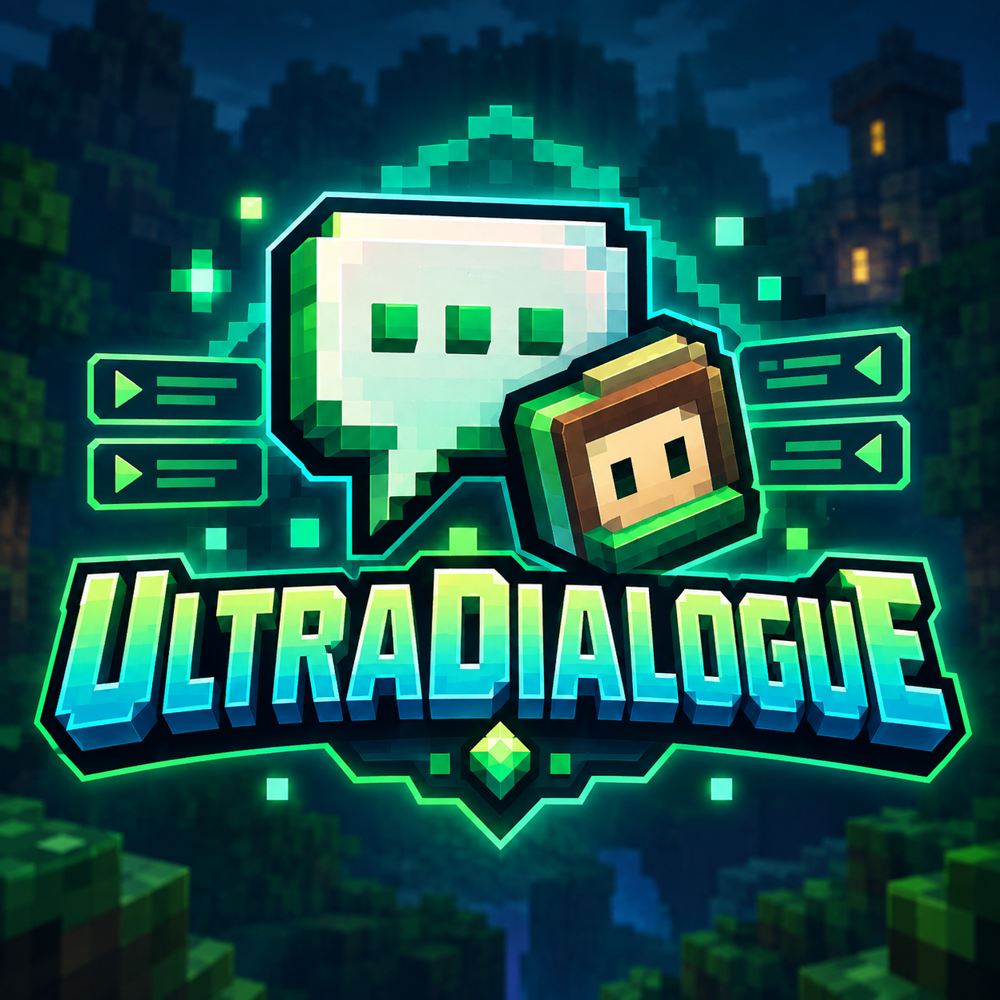
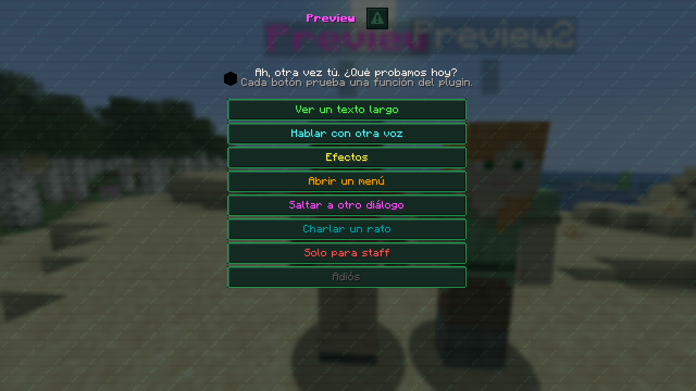
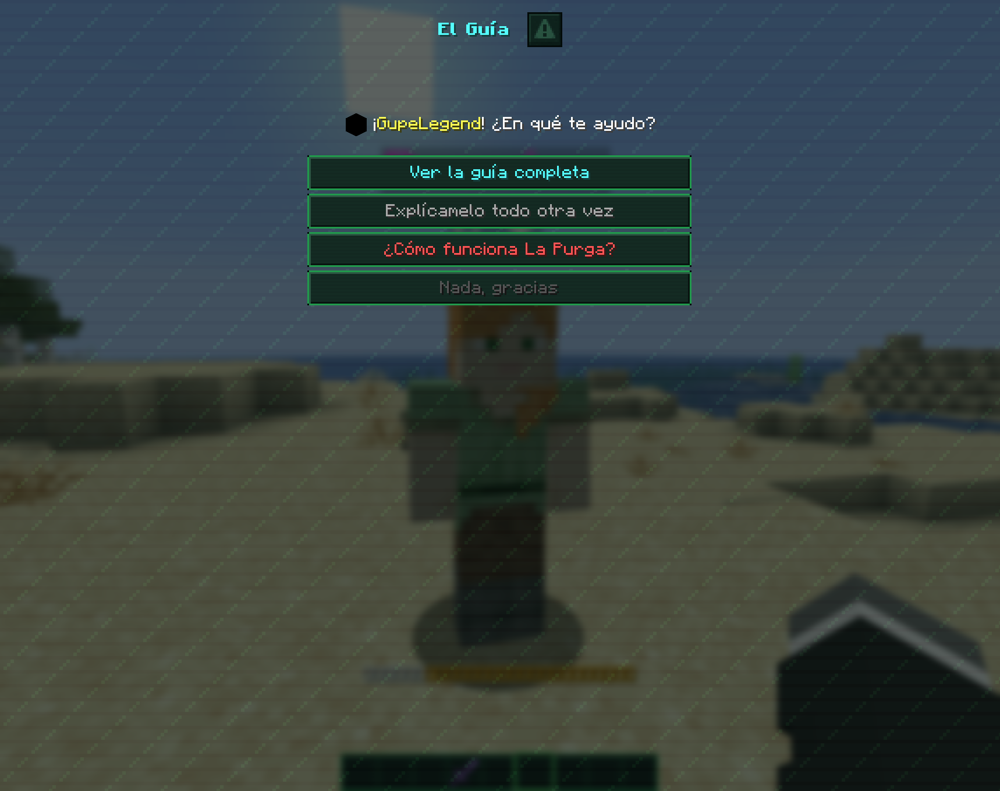
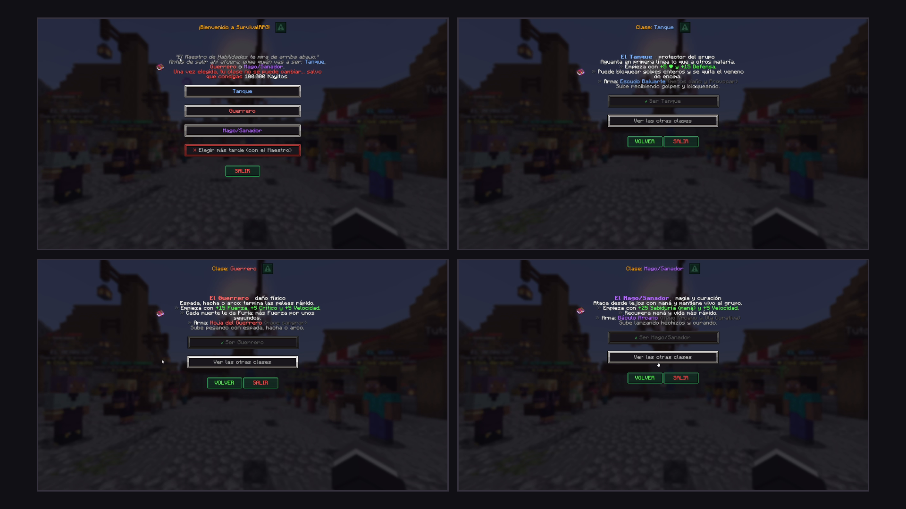

<p align="center"></p>

# UltraDialogue

[](https://papermc.io)
[](https://papermc.io)
[](https://adoptium.net)
[](LICENSE)

**Real dialogue screens for your NPCs** — a portrait, what the character says, and the player's
answers as buttons. Every answer can branch the conversation, open a menu or run commands.

A Paper plugin by **Social Studio**.

It uses the **native dialog screens** Minecraft added in 1.21.6, so there's no resource pack, no
client mod and no chat spam: the conversation opens on screen, like in an RPG.

<p align="center">
  
  
  
</p>

---

## Features

- **Branching conversations** written in YAML: nodes, answers, and where each answer leads.
- **Actions on any answer:** go to another node or dialogue, open a menu, run a player or console
  command, send a message / title / action bar, play a sound.
- **Button sizes and icons** *(1.1.1)*: four button sizes like the pause menu (from the tiny square
  to full width) and 20 built-in pixel-art icons — quest, accept, question, shop, secret, gift and
  more, some animated. Served by the plugin, with text symbols for anyone without the pack.
- **The NPC's face** *(1.1.1)*: a 2D face from the NPC's skin next to its name.
- **Deliveries** *(1.1.1)*: check, take and give items — vanilla, UltraBoss souls, or any item by
  its hidden tag, model or name. Taking is all-or-nothing and is checked again on click (no dupes).
- **Story locks and quests** *(1.1.1)*: conditions on BeautyQuests quests (`quest: completed 12`),
  its own BeautyQuests stage type, and placeholders for affinity and flags.
- **Conditions** that hide answers or change where a talk starts — permissions, player flags, and any
  PlaceholderAPI placeholder (`%vault_eco_balance% >= 1000`).
- **Player flags**: remember that someone already met a character, accepted a job or finished a
  step, and greet them differently next time. Stored on the player, no database.
- **Affinity** *(1.1)*: a hidden friendship level per player and per character. Kind answers raise
  it, rude ones lower it, and new greetings, questions and secrets unlock as it grows. Players are
  never told the number changed.
- **Conversations that never repeat** *(1.1)*: several variants per line (a different one every
  time) and questions that rotate, so talking to the same NPC twice doesn't feel scripted.
- **Portraits**: the NPC's own skin, any player's skin, a fixed texture, or any item.
- **FancyNpcs support out of the box**: link a dialogue to an NPC by name and clicking it opens the
  talk *instead of* its FancyNpcs actions. Your `npcs.yml` is never touched.
- **Any entity** can talk too, with a tag: `/tag @e[type=villager,limit=1,sort=nearest] add dialogue:merchant`.
- **Old clients** joining through ViaVersion (< 1.21.6) get the same conversation in chat, with
  clickable answers.
- **English and Spanish** built in.

## A dialogue

One file per character in `dialogues/`. The file name is the id.

```yaml
name: '&2&lThe Wandering Merchant'
npcs: [merchant]                    # FancyNpcs NPC names
portrait: 'npc | item:EMERALD'      # the NPC skin, or an emerald if it has none
start:
  - if: '!flag:met_merchant'        # first time...
    node: intro
  - node: hello                     # ...and every time after
nodes:
  intro:
    on-show: ['flag: met_merchant']
    text:
      - 'Psst! You, the one with empty pockets. Come closer.'
    next: hello                     # no answers = a "Continue" button
  hello:
    text: 'My stock changes every &fMonday&f.'
    answers:
      - text: '&2Show me your goods'
        actions: ['menu: shop']     # opens a DeluxeMenus menu
      - text: '&7Where do you get all this?'
        tooltip: '&7Hover text'
        goto: secret
      - text: '&8Not interested'
        goto: end
  secret:
    text: 'A good merchant never reveals his suppliers.'
```

`dialogues/example.yml` documents every option with comments.

### Actions

| Action | What it does |
|---|---|
| `goto: node` | Go to another node (`end` finishes the talk) |
| `dialogue: id [node]` | Switch to another dialogue |
| `menu: name` | Open a menu (runs `menu-command` from config.yml, DeluxeMenus by default) |
| `command: spawn` | Run a command as the player |
| `console: give %player% diamond 1` | Run a command from the console |
| `message:` · `broadcast:` · `actionbar:` | Text to the player / everyone / action bar |
| `title: Title\|Subtitle` | On-screen title |
| `sound: entity.villager.yes 1 1` | Also accepts `ENTITY_VILLAGER_YES` |
| `flag: x` · `unflag: x` | Set or remove a player flag |
| `affinity: +2` · `affinity: -3` · `affinity: =10` | Change affinity with this character (`affinity: kadir +2` for another one) |
| `close` | Close the screen |

When an answer ends the talk (opens a menu, runs a command…) the screen closes **before** the
actions run, so the menu stays open.

### Conditions (`if:`)

Every line of the list must match; inside a line, `||` means "or".

```
permission:group.vip       !permission:group.vip
flag:met_merchant          !flag:met_merchant
%vault_eco_balance% >= 1000          ( ==  !=  >=  <=  >  <  contains )
affinity >= 20             affinity:kadir >= 20
```

## Affinity and conversations that change

Every player has a hidden **affinity** with every character, starting at 0. Answers change it, and
conditions read it — so the same NPC can be cold with strangers and open up to friends:

```yaml
start:
  - if: 'affinity >= 25'
    node: friend
  - node: stranger

nodes:
  stranger:
    variants:                        # a different one each time, never the same twice in a row
      - 'Yes? What do you want?'
      - "I don't usually talk to strangers."
    show: 2                          # only 2 of these questions appear, picked at random
    answers:
      - text: '&7Hello. Who are you?'
        actions: ['affinity: +2']
        goto: who
      - text: '&8Out of my way.'
        actions: ['affinity: -3']
        goto: end
      - text: '&8Goodbye.'
        always: true                 # never rotated out
        goto: end
```

- **The player never sees the number** and is never told it changed. Staff can check it with
  `/ud affinity <player> <id>`.
- **Anti-farming:** a character only *gives* affinity once every `cooldown-minutes` (30 by default),
  and at most `max-per-talk` points (3) per conversation. Losing affinity has no limit.
- Defaults live in `config.yml` under `affinity:`; each dialogue can override them with its own
  `affinity:` section.
- It only exists in dialogues that use it. Menu NPCs that don't mention affinity behave exactly as
  before.
- A variant can have its own `if:` (`{text: ..., if: 'affinity >= 10'}`).

`dialogues/kadir.yml` is a complete example with four friendship levels, rotating questions and a
one-time gift.

## Button sizes and icons

```yaml
nodes:
  confirm:
    text: 'Will you take the job?'
    columns: 2                 # this node only: two buttons per row
    answers:
      - text: '&aYes'
        icon: accept
        size: 2                # half width, like "Options..."
        goto: accepted
      - text: '&cNo'
        icon: exit
        size: 2
        goto: end
      - text: ''
        icon: question         # size 1 fits only the icon, like the "report" button
        size: 1
        tooltip: '&7What is this job?'
        goto: details
```

| Size | Width | Like in the pause menu |
|---|---|---|
| `size: 1` | 20 px | the small square "report" button |
| `size: 2` | 98 px | "Options...", half width |
| `size: 3` | 150 px | a medium button |
| `size: 4` | 204 px | "Disconnect", full width |
| `width: 130` | any, 1–1024 | exact width |

Buttons are always 20 px tall — that's Minecraft. `columns:` works on the whole dialogue or on a
single node.

**Icons** (`/ud icons` lists them in game):

| Name | English | Text fallback | | Name | English | Text fallback |
|---|---|---|---|---|---|---|
| `mision` | `quest` | `!` | | `gema` | `gem` | `◆` |
| `aceptar` | `accept` | `✔` | | `espada` | `sword` | `⚔` |
| `pregunta` | `question` | `?` | | `corazon` | `heart` | `❤` |
| `charla` | `talk` | `☺` | | `calavera` | `skull` | `☠` |
| `tienda` | `shop` | `$` | | `cofre` | `chest` | `▣` |
| `secreto` | `secret` | `✦` | | `llave` | `key` | `⚷` |
| `eleccion` | `choice` | `✧` | | `mapa` | `map` | `▤` |
| `regalo` | `gift` | `❖` | | `estrella` | `star` | `★` |
| `volver` | `back` | `«` | | `libro` | `book` | `❏` |
| `salir` | `exit` | `✖` | | `staff` | `admin` | `☼` |

Animated: quest, talk, secret, choice, gift, staff, gem, heart and star.

- The icons are drawn **inside the text**, at the height of a letter, with Minecraft's sprite text
  objects (1.21.9+). The pictures come in a small resource pack that the plugin **serves by itself**
  on port **8083** and that stacks with any other pack.
- Anyone who **didn't load the pack** (declined it, download failed, or an old client through
  ViaVersion) sees the **text symbol** in the icon's colour instead — never a missing-texture square.
- `icons.mode` in `config.yml`: `auto` (default), `sprite` (always pictures — if you merge the pack
  into your own), or `text` (always symbols, no pack).

**The NPC's face:** portraits `npc`, `player:Name` and `texture:...` now show as a 2D face from the
skin, next to the NPC's name. The player's own client draws it: the server never asks Mojang for
anything. `item:` portraits still show the item on the left.

## Deliveries

| Condition | Action |
|---|---|
| `has: IRON_INGOT 16` (`tiene:`) — anywhere in the inventory | `take: IRON_INGOT 16` (`quitar:`) — all or nothing |
| `hand: IRON_INGOT 16` (`mano:`) — main hand only | `give: IRON_INGOT 16` (`dar:`) |

Items can be written as:

| Format | Matches |
|---|---|
| `IRON_INGOT` / `minecraft:iron_ingot` | that vanilla item — **only plain ones**: items with a plugin's hidden tag or their own model don't count, so `GOLD_NUGGET` never takes an UltraBoss soul |
| `ultraboss:AlmaFaraon` | an UltraBoss item (also the ones from its older names) |
| `ultrarevive:self` / `boost` / `end` | an UltraRevive totem |
| `pdc:<namespace:key>=<value>` | any plugin's hidden tag |
| `item_model:ultraboss:alma_faraon` | by item model |
| `name:&6Cellar Key` (`nombre:`) | by display name (last resort) |

```yaml
deliver:
  text: 'Did you bring the iron for the forge?'
  answers:
    - text: '&aHand over 16 iron ingots'
      icon: accept
      if: 'has: IRON_INGOT 16'
      actions:
        - 'take: IRON_INGOT 16'
        - 'give: EMERALD 4'
        - 'affinity: +3'
      goto: thanks
    - text: "&8I don't have them yet"
      if: '!has: IRON_INGOT 16'
      goto: end
```

- **`take:` is atomic**: it counts first and takes nothing if there isn't enough. Main hand first,
  then the rest of the inventory.
- **If `take:` fails, the rest of that answer's actions are cut** — a reward is never given without
  collecting first. The player gets the `item-missing` message.
- **Conditions are checked again when the button is clicked.** Open the dialogue with 16 ingots,
  drop them, press "Hand over": nothing is taken, nothing is given, the screen redraws.
- `give:` builds vanilla items itself; UltraBoss and UltraRevive items are given through their own
  command, so they come out with every tag, name and texture.
- A start rule can react to what the player is holding: `if: 'hand: IRON_INGOT 16'`.

## Story locks and BeautyQuests

Use quests (or flags, or affinity with another character) to decide what an NPC says — so players
can't skip to the end of the story:

```yaml
start:
  - if: '!quest: completed 12'
    node: too_early              # "What are you doing here? You haven't even found the key."
  - node: final_scene
```

| Condition | True when |
|---|---|
| `quest: completed <id>` (`mision: completada`) | the player finished that BeautyQuests quest |
| `quest: started <id>` (`mision: en-curso`) | it's started and not finished |
| `quest: active <key>` (`mision: activa`) | the player is **right now** at an `ULTRADIALOGUE` stage with that key |

| Action | What it does |
|---|---|
| `quest: complete <key>` (`mision: completar`) | completes every `ULTRADIALOGUE` stage with that key the player is on |
| `quest: start <id>` (`mision: empezar`) | starts the quest, respecting its requirements |
| `quest: force <id>` (`mision: forzar`) | starts it without requirements |

**The `ULTRADIALOGUE` stage type.** UltraDialogue registers its own stage in BeautyQuests, so an NPC
with a dialogue can take part in quests natively:

```yaml
# in the BeautyQuests quest file
'3':
  stageType: ULTRADIALOGUE
  key: brann_iron
  npc: brann                  # optional, only for the description
  customText: '§7Bring §f16 iron ingots §7to §fBrann'
```

```yaml
# in the dialogue
- text: '&a✔ Hand over the iron'
  if: ['quest: active brann_iron', 'has: IRON_INGOT 16']
  actions: ['take: IRON_INGOT 16', 'quest: complete brann_iron']
```

It can also be created from BeautyQuests' in-game editor (it asks for the key). Two quests on the
same key both advance.

`quest: complete` fires a plain Bukkit event, **`DialogueSignalEvent(player, key)`** — any plugin can
listen to it, with or without BeautyQuests.

**Without BeautyQuests** everything still loads: quest conditions are false, `start`/`force` do
nothing, and the console says so once per dialogue.

## Placeholders

With PlaceholderAPI:

| Placeholder | Value |
|---|---|
| `%ultradialogue_affinity_<id>%` | the player's affinity with that character |
| `%ultradialogue_flag_<flag>%` | `true` / `false` |

Use them as real quest requirements in BeautyQuests (`placeholderRequired`), to lock menu items in
DeluxeMenus, or anywhere else.

## Commands and permissions

All under `ultradialogue.admin` (op by default). Aliases: `/ud`, `/dialogue`.

| Command | |
|---|---|
| `/ud open <id> [player] [node]` | Open a dialogue by hand — works from console and from other plugins |
| `/ud reload` | Reload config, language and every dialogue |
| `/ud list` | Loaded dialogues and their NPCs |
| `/ud flags <player> [clear [flag]]` | See or clear a player's flags |
| `/ud affinity <player> [id] [set\|add\|reset] [n]` | See or change affinity (staff only; `add` ignores the anti-farming limits) |
| `/ud icons` | Every icon with its name, drawn the way that player sees them |

Players need no permission to talk to NPCs.

## Requirements

| | |
|---|---|
| **Paper** | 26.1.2 or newer |
| **Java** | 25 |

Everything else is optional and detected at runtime:

| Plugin | Used for |
|---|---|
| FancyNpcs | Clicking an NPC opens its dialogue |
| PlaceholderAPI | Placeholders in text, actions and conditions |
| DeluxeMenus | The `menu:` action (any menu plugin works — change `menu-command`) |
| ViaVersion | Sends old clients the chat version |
| BeautyQuests 2.1 | Quest conditions and actions, the `ULTRADIALOGUE` stage type |

## Install

Drop the jar in `plugins/` and start the server. Three example dialogues are created.

For the icons, open port **8083** in your host's panel. If it isn't open, the console says so and
icons fall back to their text symbols — everything else works the same.

Data lives in **`plugins/UltraView/UltraDialogue/`**, the shared folder of the Ultra plugin family.
Your config and dialogues are never overwritten on update.

When you edit a dialogue, run `/ud reload`. If something is wrong the console tells you **which file,
which node and which reference** is broken.

---

## Building

No Gradle, no Maven — just `javac`.

```bash
bash compilar.sh          # -> build/UltraDialogue-1.0.jar
```

Dependencies download to `../_libs/` on first run. You need **JDK 25**: Paper 26 is compiled for
Java 25, and with an older JDK `javac` fails with a `cannot access Player` error that looks like an
API problem but isn't.

## Project layout

```
src/main/java/mc/gupe/ultradialogue/
  UltraDialogue.java    startup and reload
  UltraView.java        the shared plugins/UltraView/<Plugin>/ folder
  Migration.java        imports data from the private plugin this one came from
  Registry.java         reads dialogues/ and validates every reference
  Dialogue.java         the model: dialogue -> nodes -> answers
  Screen.java           draws each turn (native dialog or chat) and receives the answer
  Actions.java          runs actions
  Conditions.java       evaluates if:
  Flags.java            per-player flags (PersistentDataContainer)
  Affinity.java         per-player, per-character affinity and its anti-farming limits
  Portraits.java        the item next to the text (item: portraits)
  Icons.java            the 20 icons, their text fallbacks and the NPC's 2D face
  PackManager.java      serves the icon pack and tracks who loaded it
  PackServer.java       the small HTTP server behind it
  NpcHook.java          the FancyNpcs click, by reflection
  Listeners.java        entity tags, click cooldown, quit
  Command.java          /ud
  Items.java            has / hand / take / give and the item formats
  QuestBridge.java      what UltraDialogue needs from a quest plugin
  DialogueSignalEvent   the event behind "quest: complete"
  hook/bq/              BeautyQuests: the bridge and the ULTRADIALOGUE stage (loaded only if present)
  hook/papi/            the PlaceholderAPI expansion (loaded only if present)
  Lang.java / Text.java messages, colours, placeholders

src/main/resources/
  config.yml
  lang/{en,es}.yml
  dialogues/{example,merchant,kadir}.yml
  resourcepack.zip           the icons (built from TexturePacks/UltraDialogue)
```

## Notes for contributors

**Every screen carries a token.** A stale button — from a previous screen, an old chat line, or
before a reload — does nothing. If you touch `Screen`, every `show()` must mint a new token.

**The native screen uses `afterAction(NONE)`, not `WAIT_FOR_RESPONSE`.** With `WAIT_FOR_RESPONSE`,
closing the dialog sends the client back to the screen it had *before* the wait — the same dialog —
so "Goodbye" looked like it didn't work the first time. Every path in `answer()` must end in `show()`
or `close()`.

**Classes that import another plugin live in `hook/` and are loaded by name** only when that plugin
is enabled. Never import BeautyQuests or PlaceholderAPI classes from the core: without them the JVM
would throw `NoClassDefFoundError` and the whole plugin would fail to start.

**Conditions are checked twice**: when the screen is drawn and again on click (`Screen.answer`).
Don't remove the second check — it's what stops item dupes.

**Sprites need a fallback.** A sprite the client doesn't have renders as the purple-and-black
missing texture. `Icons.of()` only sends a sprite to players whose `PlayerResourcePackStatusEvent`
said `SUCCESSFULLY_LOADED` for this plugin's pack; everyone else gets the text symbol.

**Never ask Mojang for a skin on the main thread.** `player:` portraits are resolved in the
background when dialogues load and cached.

**Optional integrations go through reflection.** FancyNpcs, PlaceholderAPI and ViaVersion are looked
up by name, so the plugin compiles and starts without them. `NpcHook` uses the FancyNpcs 2.12.1
signatures; if a future version changes them, the console says so and NPCs fall back to their normal
actions.

**The flag key carries the plugin name.** `new NamespacedKey(plugin, "flags")` is stored as
`ultradialogue:flags`. This plugin started as a private one called "Dialogos", so `Flags` still reads
`dialogos:marcas` and moves it over. Don't remove that bridge.

**Both English and Spanish keys are accepted** in dialogue files (`text`/`texto`, `goto`/`ir`,
`answers`/`respuestas`…), so the private plugin's files load untouched.

Code comments are written in Spanish.

## License

[MIT](LICENSE) © 2026 Social Studio
